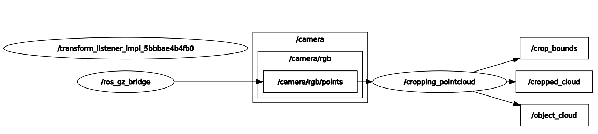
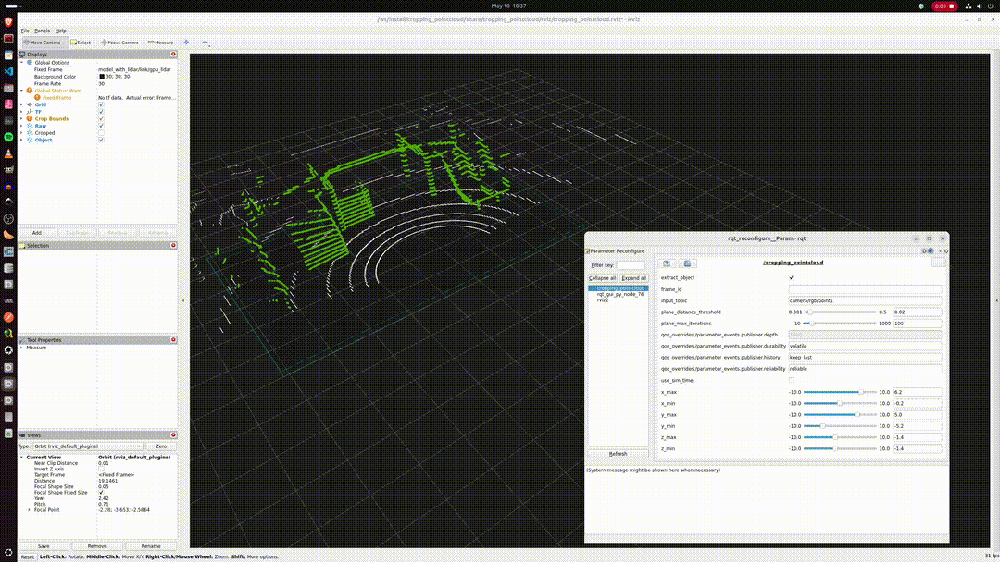
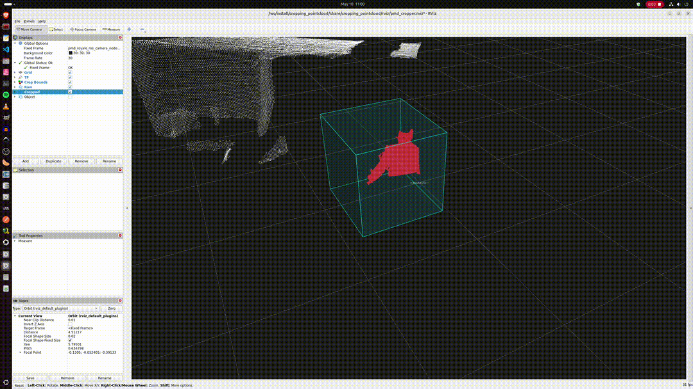

# Cropping Pointcloud

[](LICENSE)
[](#tested-platforms)
[](https://github.com/behnamasadi/cropping_pointcloud/actions/workflows/ci.yml)

A ROS 2 node that crops an incoming `sensor_msgs/PointCloud2` against an
axis-aligned bounding box (six tunable bounds) and optionally extracts the
dominant non-planar object via RANSAC plane removal. The cropping volume is
**live-tunable** at runtime — drag the rqt sliders, see the cropped cloud
update in RViz immediately. The current AABB is also published as a
`visualization_msgs/MarkerArray` so RViz draws the volume itself, in sync
with the sliders.

| Source scene (Gazebo) | Live-tunable bounds (rqt) |
|---|---|
|  |  |

| `/camera/rgb/points` (raw) | `/cropped_cloud` (AABB-clipped) | `/object_cloud` (after RANSAC plane removal) |
|---|---|---|
|  |  |  |







> The original ROS 1 (Kinetic/Noetic) implementation is preserved as the
> git tag **`ros1-legacy`**.

---

## Architecture

The `cropper` is sensor-agnostic. By default `docker compose up` starts
**only the cropper**, which subscribes to its `input_topic` parameter and
waits — bring your own publisher (a real sensor driver, the bundled Gazebo
demo, a `ros2 bag play`, another container on another host) and DDS
auto-discovery does the rest.

```
                                 input topic                ┌──────────────────────────────────────┐
   any PointCloud2 publisher  ───────────────────────────►  │ cropper (perception + GUI)           │
   ─ Gazebo (demo profile)        DDS  /  intra-process     │   ─ cropping_pointcloud node         │
   ─ 3D ToF camera driver                                   │     publishes /cropped_cloud,        │
   ─ rosbag2 / real driver                                  │                /object_cloud,        │
                                                            │                /crop_bounds (markers)│
                                                            │   ─ RViz2 (preset layout)            │
                                                            │   ─ rqt Dynamic Reconfigure sliders  │
                                                            └──────────────────────────────────────┘
```

Two flavours of "publisher + subscriber in the same room" are supported:

* **Two containers, DDS in between** — easy to reason about, easy to split
  across machines. Default.
* **Single process, intra-process zero-copy** — the ROS 2 equivalent of
  ROS 1 nodelets. The cropper is also built as a composable node (a
  shared library registered with `rclcpp_components`); load it together
  with the publisher in one `ComposableNodeContainer` with
  `use_intra_process_comms=True` and `PointCloud2` messages are moved by
  `unique_ptr` — no serialization, no DDS round-trip. See
  [Example 3](#example-3--tof-camera-with-single-process-composition-zero-copy).

| Service | Profile | Image | Purpose |
|---|---|---|---|
| `cropper` | *default* | `cropping_pointcloud/cropper` | The cropping node + RViz2 + rqt Dynamic Reconfigure. Built on `osrf/ros:*-desktop-full` so PCL + RViz are already present. |
| `gazebo`  | `demo`    | `cropping_pointcloud/gazebo`  | Headless Gazebo (`gpu_lidar_sensor.sdf`) + `parameter_bridge`, emits `sensor_msgs/PointCloud2` on `/camera/rgb/points`. Opt-in only. |

## Tested platforms

| `ROS_DISTRO` | Ubuntu | PCL | Gazebo | apt package | CLI |
|---|---|---|---|---|---|
| **`humble`** (LTS, 2022 → 2027) | 22.04 (Jammy) | 1.12 | **Fortress** | `ignition-fortress` | `ign gazebo` |
| **`jazzy`** (LTS, 2024 → 2029) | 24.04 (Noble) | 1.14 | **Harmonic** | `gz-harmonic` | `gz sim` |

The `.env` file at the repo root selects the pairing (default: Humble +
Fortress). Switch by uncommenting the Jazzy block:

```ini
# .env
ROS_DISTRO=humble
GZ_PKG=ignition-fortress
GZ_CMD=ign gazebo

# ROS_DISTRO=jazzy
# GZ_PKG=gz-harmonic
# GZ_CMD=gz sim

ROS_DOMAIN_ID=42
```

---

## Quick start

```bash
# 1. clone
git clone https://github.com/behnamasadi/cropping_pointcloud.git
cd cropping_pointcloud

# 2. allow X11 from containers (once per host login session)
xhost +local:docker

# 3. build the cropper image
#    ~30 s — FROM osrf/ros:*-desktop-full, only adds rqt_reconfigure + colcon build
docker compose build

# 4. bring up the cropper — it subscribes and waits
docker compose up
```

Four windows pop up:

1. **RViz2** — preset layout from `rviz/cropping_pointcloud.rviz`. Five
   displays: TF axes, the live `Crop Bounds` (cyan box + wireframe), and
   three PointCloud2s (white = raw input, red = `/cropped_cloud`, green =
   `/object_cloud` after plane removal). The point clouds will be empty
   until you connect a publisher in [Examples](#examples).
2. **rqt Dynamic Reconfigure** — pinned to the `/cropping_pointcloud` node.
   Sliders for the six bounds, RANSAC distance threshold, RANSAC iteration
   cap. Drag a slider; the cyan AABB in RViz reshapes immediately.
3. **rqt_graph** — live node/topic graph: who publishes what, who
   subscribes. Switch the dropdown to **Nodes/Topics (all)** and untick
   *Hide → Dead sinks / Leaf topics / Debug* to see the full picture.
   Hit the refresh button after starting a publisher (Terminal B in the
   examples) so the new node and its edges show up.
4. **(Optional) Gazebo** — only if you started it via `--profile demo`.

Pass `graph:=false` (or `gui:=false` for fully headless) to any launch
file to suppress windows.

---

## Examples

Each example is a **two-terminal recipe**: terminal A starts the cropper
and leaves it subscribed; terminal B starts a publisher. The cropper
doesn't care which publisher feeds it — DDS auto-discovers anything on
the same `ROS_DOMAIN_ID`.

### Example 1 — bundled Gazebo demo (no extra hardware)

Self-contained, useful for first-run sanity checks. Generates a 16-beam
GPU lidar at ~10 Hz from a small simulated scene.

#### Terminal A — start the cropper

```bash
cd cropping_pointcloud
docker compose up        # subscribes to camera/rgb/points and waits
```

#### Terminal B — start the bundled Gazebo source

```bash
cd cropping_pointcloud

# build the gazebo image (~5 min first time — Ignition Fortress apt install)
docker compose --profile demo build gazebo

# launch the simulation; ros_gz_bridge republishes the GPU lidar on /camera/rgb/points
docker compose --profile demo up gazebo
```

RViz lights up immediately with the raw + cropped + object clouds. The
scene contains a `model_with_lidar` chassis at world (4, 0, 0.5) facing −X,
a 1 m³ obstacle box at (0, −1, 0.5), a small box at (0.05, 0.05, 0.05),
and the OpenRobotics Playground model. The default bounds in
`cropping_demo.launch.py` already match the lidar-local geometry of this
scene, so the red and green clouds are populated out of the box.

Tear-down:

```bash
docker compose --profile demo down
```

---

### Example 2 — 3D ToF camera

Tested with the [`pmd-royale-ros`](https://github.com/pmdtechnologies/pmd-royale-ros)
ROS 2 driver as a representative 3D ToF camera, but anything that
publishes a `sensor_msgs/PointCloud2` from a depth/ToF sensor works the
same way. The repo ships `launch/pmd_cropper.launch.py` and
`rviz/pmd_cropper.rviz`, both pre-tuned for a small object on a desk
~30 cm in front of the lens (REP-103 optical-frame conventions; AABB
defaults ±15 cm × ±20 cm × 15–60 cm; RViz Fixed Frame already set to the
camera **link** frame so depth renders horizontally — see
[Coordinate frames](#coordinate-frames-in-rviz-axis-flip)).

> The ToF camera driver itself has its own docker setup (vendor SDK, USB
> permissions, hot-plug handling) which lives outside this repo. A
> reference setup is documented at `~/ros2_ws/docker/pmd/` on the
> author's machine; use that as a template or substitute the upstream
> driver however you prefer. Just make sure something publishes
> `/pmd_royale_ros_camera_node/point_cloud_0`.

#### Terminal A — start the cropper using the ToF-specific launch file

```bash
cd cropping_pointcloud
docker compose run --rm cropper \
  ros2 launch cropping_pointcloud pmd_cropper.launch.py
```

This swaps the cropper's `input_topic` to
`/pmd_royale_ros_camera_node/point_cloud_0`, loads the desk-scale tuned
bounds, and uses `rviz/pmd_cropper.rviz` (link-frame view, desk-scale
orbit).

#### Terminal B — start the ToF camera driver

The cropper in Terminal A already runs RViz, so Terminal B only needs to
publish the point cloud — no second RViz. The driver package ships two
launch files for exactly this split:

| Launch file | What it runs | Use when |
|---|---|---|
| `any_camera.launch.py`      | driver only          | Pairing with the cropper (this example) — recommended |
| `any_camera_rviz.launch.py` | driver + RViz        | Standalone driver sanity check, no cropper |

Driver only (recommended, pairs with the cropper's RViz in Terminal A):

```bash
docker compose -f ~/ros2_ws/docker/pmd/compose.yml run --rm pmd \
  ros2 launch pmd_royale_ros_examples any_camera.launch.py
```

Driver + its own RViz (standalone, no cropper):

```bash
docker compose -f ~/ros2_ws/docker/pmd/compose.yml up
# the compose's default CMD is `any_camera_rviz.launch.py`
```

(or substitute your own launch / driver — anything that publishes the
point cloud topic above will work).

Quick check from a third terminal:

```bash
docker compose exec cropper bash -lc \
  'source /opt/ros/humble/setup.bash &&
   ros2 topic hz /pmd_royale_ros_camera_node/point_cloud_0
   ros2 topic hz /cropped_cloud'
# both should hit ~30 Hz
```





---

### Example 3 — ToF camera with single-process composition (zero-copy)

The two-container approach in Example 2 exchanges `PointCloud2` messages
over DDS — that costs a serialize / deserialize on every frame. For a
224 × 172 ToF cloud at 30 Hz it's small; for an HD lidar or a dense RGB-D
it adds up.

ROS 1 had a workaround called **nodelets**: load the publisher and the
subscriber into one *nodelet manager* and they pass each other shared
pointers, no serialization. The ROS 2 equivalent is **components +
intra-process communication**:

* every node that wants to participate is built as a *composable node*
  (a shared library that registers itself with `rclcpp_components`);
* a `ComposableNodeContainer` (single process, multi-threaded executor)
  loads them all;
* each is loaded with `extra_arguments=[{'use_intra_process_comms': True}]`;
* publishers must use `volatile` durability (transient_local is rejected
  by the intra-process path).

The cropper ships **both forms** — the standalone executable used in
Examples 1, 2 and 4, and a shared library
(`libcropping_pointcloud_component.so`, registered as `CroppingPointCloud`)
used here.

#### Single terminal — driver + cropper in one process

```bash
cd ~/ros2_ws/docker/pmd-cropper
xhost +local:root
docker compose --profile intraproc up
```

That builds (if needed) and launches a unified image which has *both*
`libpmd_royale_ros_node.so` and `libcropping_pointcloud_component.so`,
running:

```
ros2 launch cropping_pointcloud pmd_cropper_intraproc.launch.py
```

— a single `component_container_mt` with three composable nodes (static
TF, ToF camera, cropper). `PointCloud2` messages move from driver to
cropper as moved `unique_ptr`s. Verify with:

```bash
# one process, not two
docker compose --profile intraproc exec pmd-cropper bash -lc \
  'ps -ef | grep component_container_mt | grep -v grep'

# rate matches the camera, regardless of any DDS network tuning
docker compose --profile intraproc exec pmd-cropper bash -lc \
  'source /opt/ros/humble/setup.bash &&
   source /ros2_ws/install/setup.bash &&
   ros2 topic hz /cropped_cloud'
```

> The unified `intraproc.Dockerfile` and the combined compose live at
> `~/ros2_ws/docker/pmd-cropper/`, outside this repo. They're convenience
> scaffolding — the `pmd_cropper_intraproc.launch.py` itself is in this
> repo and will work in any image that has both component libraries
> available.

---

### Example 4 — your own publisher (real driver, rosbag, etc.)

The cropper subscribes to whatever `input_topic` points at. Two ways to
hook up an arbitrary publisher.

#### Terminal A — start the cropper

```bash
cd cropping_pointcloud
docker compose up                                     # default input_topic = camera/rgb/points
# or override at launch time:
docker compose run --rm cropper \
  ros2 run cropping_pointcloud cropping_pointcloud --ros-args \
    -p input_topic:=/your/sensor/topic
```

#### Terminal B — feed any PointCloud2 publisher into the same DDS bus

Replay a bag from the host:

```bash
docker run --rm -it --net=host -v /path/to/bag:/bag \
  osrf/ros:humble-desktop-full \
  bash -lc 'source /opt/ros/humble/setup.bash &&
            ros2 bag play /bag --remap /your/topic:=/camera/rgb/points'
```

Or run a real driver in any container / on any host on the same
`ROS_DOMAIN_ID`. Switching `input_topic` at runtime also works:

```bash
docker compose exec cropper bash -lc \
  'source /opt/ros/humble/setup.bash &&
   ros2 param set /cropping_pointcloud input_topic /your/sensor/topic'
```

---

## Coordinate frames in RViz (axis flip)

ToF / depth camera drivers publish point clouds in an *optical frame*
(REP-103 convention: **X right, Y down, Z forward**). RViz's grid is
laid out as if the world followed the *robot* convention (**X forward,
Y left, Z up**), so depth-along-Z appears vertical and the scene looks
upside-down.

The driver also broadcasts a static TF from the camera's **link**
frame (robot convention) to its **optical_frame**:

```
pmd_royale_ros_camera_node_link  →  pmd_royale_ros_camera_node_optical_frame
```

Fix is purely an RViz display setting — change **Global Options → Fixed
Frame** to the link frame. RViz applies the static TF on render and the
cloud appears with depth along world-X.

The bundled `pmd_cropper.rviz` already defaults to the link frame. To go
back to the optical frame, use the dropdown in RViz's Displays panel — no
rebuild, no parameter change. There is intentionally **no rqt knob for
this** because Fixed Frame isn't a ROS parameter; it's part of the RViz
display config (saved into the `*.rviz` YAML).

---

## Configuration

### Launch files

The package ships three launch files, one per recipe:

| File | Use case | Bounds preset | RViz config |
|---|---|---|---|
| `cropping_demo.launch.py`         | Gazebo demo (Example 1) | x[−2, 8], y[−5, 5], z[−1, 2] m  | `cropping_pointcloud.rviz` |
| `pmd_cropper.launch.py`           | ToF camera, two-process (Example 2) | x[−0.15, 0.15], y[−0.20, 0.20], z[0.15, 0.60] m | `pmd_cropper.rviz` |
| `pmd_cropper_intraproc.launch.py` | ToF camera, single-process (Example 3) | same desk-scale | `pmd_cropper.rviz` |

All three accept two GUI knobs:

| Arg | Default | Effect |
|---|---|---|
| `gui`   | `true` | RViz2 + rqt_reconfigure + rqt_graph. Set `false` for fully headless. |
| `graph` | `true` | rqt_graph window (node/topic connectivity view). Set `false` to keep RViz + sliders but skip the graph. Ignored when `gui:=false`. |

```bash
# fully headless
docker compose run --rm cropper \
  ros2 launch cropping_pointcloud pmd_cropper.launch.py gui:=false

# RViz + sliders, but no graph window
docker compose run --rm cropper \
  ros2 launch cropping_pointcloud pmd_cropper.launch.py graph:=false
```

### `.env`

| Variable | Default | What it does |
|---|---|---|
| `ROS_DISTRO` | `humble` | Picks the base images. `gazebo` uses `ros:${ROS_DISTRO}-ros-base`; `cropper` uses `osrf/ros:${ROS_DISTRO}-desktop-full`. |
| `GZ_PKG` | `ignition-fortress` | Gazebo apt package. |
| `GZ_CMD` | `ign gazebo` | CLI to launch Gazebo. Becomes `gz sim` on Jazzy. |
| `ROS_DOMAIN_ID` | `42` | DDS partition; both services use the same value. |

### Live tuning

While the stack is up:

```bash
# rqt is already running — drag the sliders for x_max, y_min, etc.

# Or from any shell on the host:
docker compose exec cropper bash -lc \
  'source /opt/ros/humble/setup.bash &&
   ros2 param set /cropping_pointcloud x_max 0.10'

# Save current values:
docker compose exec cropper bash -lc \
  'source /opt/ros/humble/setup.bash &&
   ros2 param dump /cropping_pointcloud > /tmp/tuned.yaml'
```

### GPU acceleration

The compose file requests an NVIDIA GPU on both services (helps lidar
sensor rendering and dense-cloud display in RViz). Requires the host to
have:

1. The NVIDIA driver installed.
2. The [NVIDIA Container Toolkit](https://docs.nvidia.com/datacenter/cloud-native/container-toolkit/)
   installed and configured for Docker.

Without an NVIDIA GPU, comment out the `deploy:` blocks in
`docker-compose.yml`. Sensor rendering falls back to Mesa / software;
everything still runs.

---

## Splitting across machines (real-world deployment)

The default compose layout — cropper alone, no bundled data source —
already *is* the multi-host case. Run the cropper on your operator
workstation, run the publisher (a sensor driver, the bundled Gazebo demo,
a `ros2 bag play` process, …) on a robot, NVIDIA Jetson, or another
machine.

Put the same `ROS_DOMAIN_ID` and `RMW_IMPLEMENTATION` on every machine.
As long as DDS multicast traverses the network (or you configure unicast
peer discovery), the cropper sees the data source.

> **Multicast caveat:** corporate switches and Wi-Fi often drop multicast.
> The standard fix is either Cyclone DDS with explicit `CYCLONEDDS_URI`
> peer config, or [`rmw_zenoh`](https://github.com/ros2/rmw_zenoh)'s
> discovery server.

---

## Topics

| Direction | Topic | Type | QoS |
|---|---|---|---|
| in  | `camera/rgb/points` (default; remappable via `input_topic` param) | `sensor_msgs/msg/PointCloud2` | `SensorDataQoS` |
| out | `cropped_cloud` | `sensor_msgs/msg/PointCloud2` | `SensorDataQoS` |
| out | `object_cloud` | `sensor_msgs/msg/PointCloud2` | `SensorDataQoS` (only when `extract_object=true`) |
| out | `crop_bounds`  | `visualization_msgs/msg/MarkerArray` | `Reliable` + `Volatile` |

`/crop_bounds` carries two markers — a translucent cube filling the AABB
and the 12 wireframe edges of the same box. The bundled RViz configs
already display them, so when you drag a bound in rqt the box reshapes
immediately. Combined with the TF axes display you can see the camera
origin and the slab the cropper is keeping side-by-side in the same view.
The QoS is `volatile` because intra-process composition (Example 3)
rejects `transient_local`.

## Parameters

| Name | Type | Node default | Range / step | Description |
|---|---|---|---|---|
| `input_topic` | string | `camera/rgb/points` | — | Input point cloud topic |
| `frame_id` | string | `""` | — | Override the output `frame_id` (empty = keep input frame) |
| `extract_object` | bool | `true` | — | Run RANSAC plane removal on the cropped cloud |
| `plane_distance_threshold` | double | `0.02` | `[0.001, 0.5]` step `0.001` | RANSAC inlier distance threshold (m) |
| `plane_max_iterations` | int | `100` | `[10, 1000]` step `1` | RANSAC iteration cap |
| `x_min`, `x_max` | double | `-0.44`, `0.30` | `[-10.0, 10.0]` step `0.01` | Crop bounds along X (m) |
| `y_min`, `y_max` | double | `-1.00`, `0.24` | `[-10.0, 10.0]` step `0.01` | Crop bounds along Y (m) |
| `z_min`, `z_max` | double | `-1.00`, `1.08` | `[-10.0, 10.0]` step `0.01` | Crop bounds along Z (m) |

> The "Node default" column is what the C++ node sets when no value is
> supplied. Each launch file in `launch/` overrides these — see the
> [Launch files](#launch-files) table for the per-recipe values you'll
> actually run with. All bounds are live-updatable and take effect on
> the next callback.

---


### Gazebo demo (Example 1)

| Symptom | Fix |
|---|---|
| `parameter_bridge` runs but `ros2 topic hz /camera/rgb/points` is silent | Gazebo started paused. The entrypoint passes `-r` so this shouldn't happen — check `docker compose logs gazebo` for crashes, particularly libEGL warnings that escalate to errors. |
| Cropped cloud is empty even with wide bounds | The lidar `frame_id` is `model_with_lidar/link/gpu_lidar`; bounds are interpreted in **that** frame, not world. Sensor is at world (4, 0, 0.5) facing −X, so the obstacle box at world (0, −1, 0.5) sits at lidar-local x≈4. The defaults already account for this. |

### ToF camera (Examples 2 and 3)

| Symptom | Fix |
|---|---|
| `[pmd_royale_ros_camera_node]: No suitable cameras found!` | First-run calibration cache is cold. Royale takes up to 30 s the very first time it sees a camera; restart the container and it works. The `pmd-cropper` compose mounts a named volume at `/root/.royale` so the cache survives container recreates. |
| Camera not visible at all (`lsusb -d 1c28:` empty) | USB unplugged or not enumerated. Reseat the cable and re-check. Inside the container, `lsusb` may not be installed but `/dev/bus/usb/<bus>/<dev>` should exist; the compose bind-mounts `/dev/bus/usb` so hot-plug works. |
| Cloud appears upside-down or sideways in RViz | Frame convention mismatch — see [Coordinate frames](#coordinate-frames-in-rviz-axis-flip). Switch RViz Fixed Frame from the optical_frame to the link frame. |
| `/object_cloud` empty but `/cropped_cloud` has data | RANSAC isn't finding a plane in the cropped slab. Either there's no flat surface in the box (raise `plane_max_iterations` or extend the bounds to include the desk), or the threshold is too tight (raise `plane_distance_threshold` from `0.01` to `0.02`). |
| `intraprocess communication allowed only with volatile durability` | Stale image. The `crop_bounds` publisher used to be `transient_local`; rebuild with `docker compose --profile intraproc build pmd-cropper`. |

---

## Building from source on the host (no Docker)

If you'd rather not use Docker:

```bash
mkdir -p ~/ros2_ws/src
cd ~/ros2_ws/src
git clone https://github.com/behnamasadi/cropping_pointcloud.git
cd ~/ros2_ws
rosdep install --from-paths src --ignore-src -y
colcon build --packages-select cropping_pointcloud --symlink-install
source install/setup.bash

# standalone executable
ros2 run cropping_pointcloud cropping_pointcloud

# or a launch file
ros2 launch cropping_pointcloud cropping_demo.launch.py
```

This produces both the standalone executable and the
`libcropping_pointcloud_component.so` shared library, so a
`ComposableNodeContainer` can load `CroppingPointCloud` directly without
Docker.

You'll need ROS 2 Humble (Ubuntu 22.04) or Jazzy (Ubuntu 24.04) on the
host.

---

## License

BSD-3-Clause. See [`LICENSE`](LICENSE).
