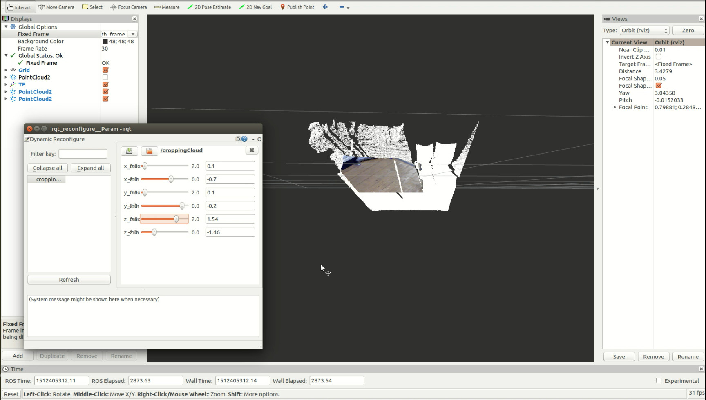
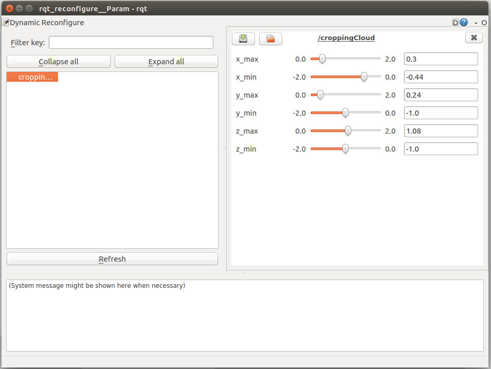

# Cropping Pointcloud

A ROS 2 node that crops an incoming `sensor_msgs/PointCloud2` against an axis-aligned bounding box (six tunable bounds) and optionally extracts the dominant non-planar object via RANSAC plane removal. The cropping volume is **live-tunable** at runtime — slide the bounds, see the cropped cloud update in RViz immediately.






> The original ROS 1 (Kinetic/Noetic) implementation is preserved as the git tag **`ros1-legacy`**.

---

## Build

```bash
mkdir -p ~/ros2_ws/src
cd ~/ros2_ws/src
git clone https://github.com/behnamasadi/cropping_pointcloud.git
cd ~/ros2_ws
rosdep install --from-paths src --ignore-src -y
colcon build --packages-select cropping_pointcloud --symlink-install
source install/setup.bash
```

Tested on ROS 2 Humble (Ubuntu 22.04) with PCL 1.12.

## Run

With the bundled launch file (loads `config/cropping_pointcloud.yaml`):

```bash
ros2 launch cropping_pointcloud cropping_pointcloud.launch.py
```

Or directly:

```bash
ros2 run cropping_pointcloud cropping_pointcloud
```

Override the input topic and frame:

```bash
ros2 run cropping_pointcloud cropping_pointcloud --ros-args \
  -p input_topic:=/camera/depth_registered/points \
  -p frame_id:=camera_link
```

## Topics

| Direction | Topic | Type | QoS |
|---|---|---|---|
| in  | `camera/rgb/points` (default; remappable via `input_topic` param) | `sensor_msgs/msg/PointCloud2` | `SensorDataQoS` |
| out | `cropped_cloud` | `sensor_msgs/msg/PointCloud2` | `SensorDataQoS` |
| out | `object_cloud` | `sensor_msgs/msg/PointCloud2` | `SensorDataQoS` (only when `extract_object=true`) |

## Parameters

| Name | Type | Default | Description |
|---|---|---|---|
| `input_topic` | string | `camera/rgb/points` | Input point cloud topic |
| `frame_id` | string | `""` (keep input frame) | Override the output `frame_id` |
| `extract_object` | bool | `true` | Run RANSAC plane removal on the cropped cloud |
| `plane_distance_threshold` | double | `0.02` | RANSAC inlier distance threshold (m) |
| `plane_max_iterations` | int | `100` | RANSAC iteration cap |
| `x_min`, `x_max` | double | `-0.44`, `0.30` | Crop bounds along X (m) |
| `y_min`, `y_max` | double | `-1.00`, `0.24` | Crop bounds along Y (m) |
| `z_min`, `z_max` | double | `-1.00`, `1.08` | Crop bounds along Z (m) |

All bounds are live-updatable and take effect on the next callback.

## Live tuning (replacing `dynamic_reconfigure`)

ROS 2 has no `dynamic_reconfigure` package — the equivalent is **native parameters with an on-set callback**, which the node already wires up. Tune from the CLI:

```bash
ros2 param set /cropping_pointcloud x_max 0.5
ros2 param set /cropping_pointcloud z_min -0.3
```

Use the rqt **Dynamic Reconfigure** plugin (it works against any node that exposes parameters):

```bash
rqt
# Plugins → Configuration → Dynamic Reconfigure → select /cropping_pointcloud
```

Save / load tuned configurations:

```bash
ros2 param dump /cropping_pointcloud > tuned.yaml
ros2 param load /cropping_pointcloud tuned.yaml
```

## Quick visual test (no real camera)

```bash
# Replay any rosbag2 that contains a PointCloud2 topic, e.g.:
ros2 bag play my_kinect_recording --remap /camera/depth/points:=/camera/rgb/points

# In another shell:
ros2 launch cropping_pointcloud cropping_pointcloud.launch.py

# Visualize both clouds:
rviz2
# Add → PointCloud2 → /camera/rgb/points (white)
# Add → PointCloud2 → /cropped_cloud
# Add → PointCloud2 → /object_cloud
```

---

## License

BSD-3-Clause. See [`LICENSE`](LICENSE).
