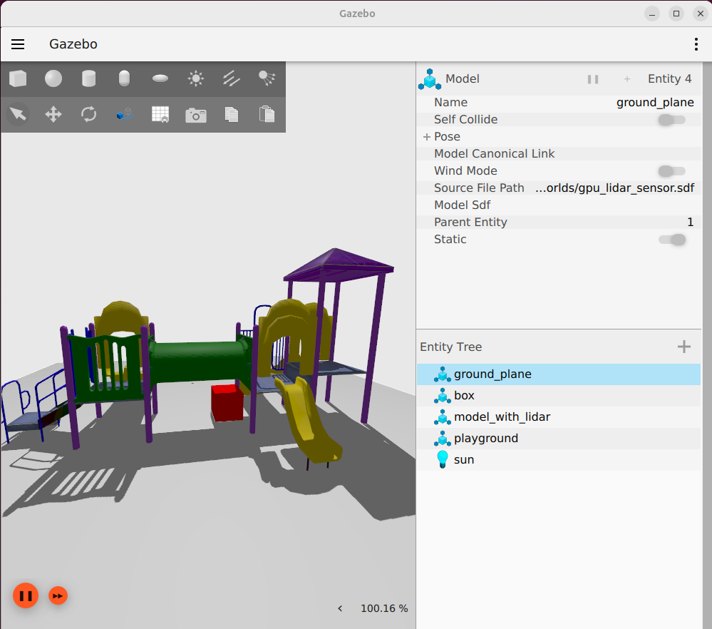
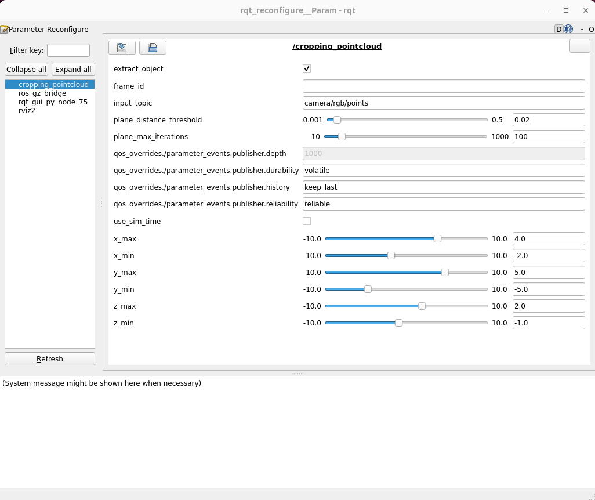
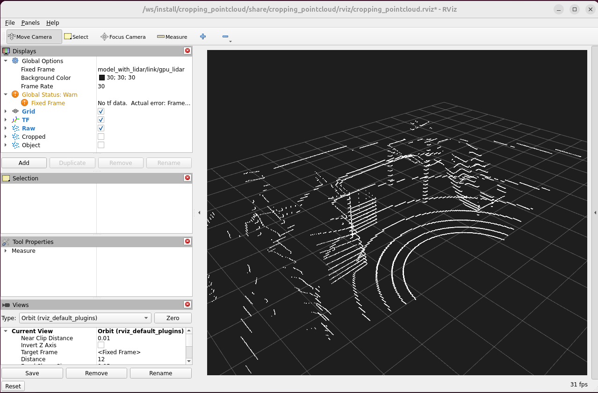
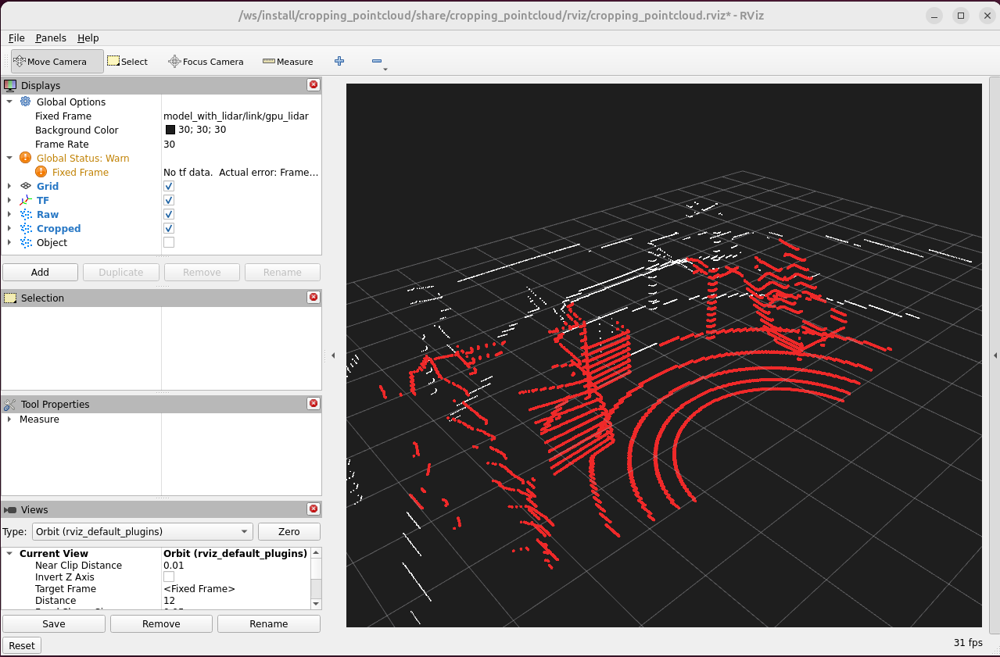
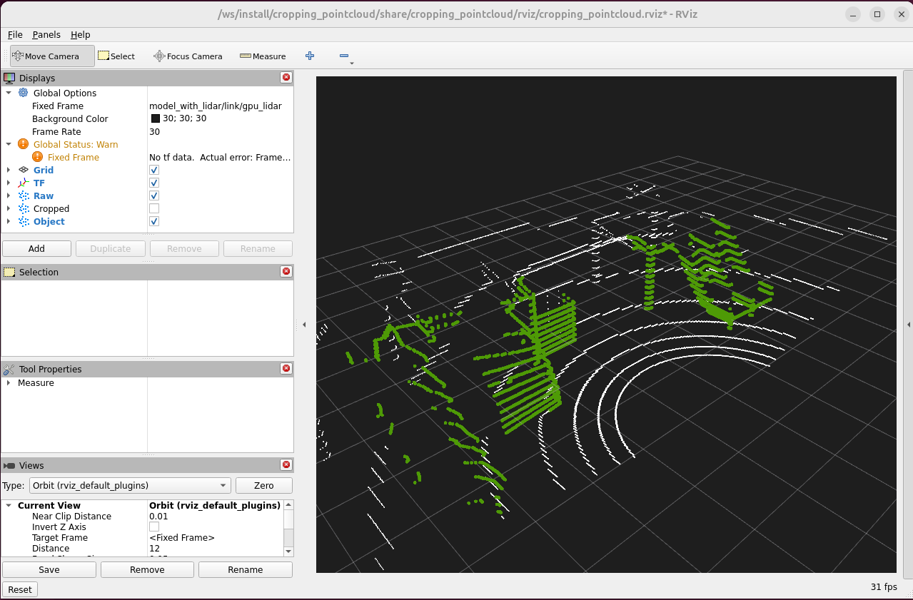

# Cropping Pointcloud

[](LICENSE)
[](#tested-platforms)
[](https://github.com/behnamasadi/cropping_pointcloud/actions/workflows/ci.yml)

A ROS 2 node that crops an incoming `sensor_msgs/PointCloud2` against an axis-aligned bounding box (six tunable bounds) and optionally extracts the dominant non-planar object via RANSAC plane removal. The cropping volume is **live-tunable** at runtime — drag the rqt sliders, see the cropped cloud update in RViz immediately.

| Source scene (Gazebo) | Live-tunable bounds (rqt) |
|---|---|
|  |  |

| `/camera/rgb/points` (raw) | `/cropped_cloud` (AABB-clipped) | `/object_cloud` (after RANSAC plane removal) |
|---|---|---|
|  |  |  |

> The original ROS 1 (Kinetic/Noetic) implementation is preserved as the git tag **`ros1-legacy`**.

---

## Architecture

**One default unit, one optional demo unit.** The cropper subscribes to a
`sensor_msgs/PointCloud2` topic and waits — by default it does **not** start
any data source. Plug in whatever you like (real sensor driver, `ros2 bag
play`, another container on another host) and DDS auto-discovery does the
rest. A bundled Gazebo scene is included as an opt-in **`demo` profile** so
the pipeline can also be exercised end-to-end with a single command.

```
                                /input topic              ┌──────────────────────────────────────┐
  any data source ────────────────────────────────────────► cropper (perception + GUI)           │
  (sensor driver, rosbag, gz)   PointCloud2 (DDS)         │   ─ cropping_pointcloud node         │
                                                          │     (publishes /cropped_cloud,       │
                                                          │      /object_cloud)                  │
                                                          │   ─ RViz2 (preset layout)            │
  ── opt-in: `--profile demo` ──                          │   ─ rqt Dynamic Reconfigure sliders  │
  gazebo (Fortress / Harmonic) ─►                         │                                      │
  headless gpu_lidar_sensor.sdf                           └──────────────────────────────────────┘
                                                                  docker/cropper.Dockerfile
```

| Service | Profile | Image | Purpose |
|---|---|---|---|
| `cropper` | *default* | `cropping_pointcloud/cropper` | One launch file (`cropping_demo.launch.py`) starts: the cropping node (publishes `/cropped_cloud` + `/object_cloud`), RViz2 with the bundled layout, rqt Dynamic Reconfigure pinned to the node. Built on `osrf/ros:*-desktop-full` so PCL + RViz are already present — only `rqt_reconfigure` is added. |
| `gazebo`  | `demo`    | `cropping_pointcloud/gazebo`  | Headless Gazebo (`gpu_lidar_sensor.sdf`) + `parameter_bridge`. Emits `sensor_msgs/PointCloud2` on `/camera/rgb/points`. Only runs when `--profile demo` is active. |

## Tested platforms

| `ROS_DISTRO` | Ubuntu | PCL | Gazebo | apt package | CLI |
|---|---|---|---|---|---|
| **`humble`** (LTS, 2022 → 2027) | 22.04 (Jammy) | 1.12 | **Fortress** | `ignition-fortress` | `ign gazebo` |
| **`jazzy`** (LTS, 2024 → 2029) | 24.04 (Noble) | 1.14 | **Harmonic** | `gz-harmonic` | `gz sim` |

> Iron and Garden are skipped — Iron is EOL since Nov 2024; Garden was a transitional Gazebo release. Humble and Jazzy cover both active LTS users.

The `.env` file at the repo root selects the pairing (default: Humble + Fortress). Switch by uncommenting the Jazzy block:

```ini
# .env
ROS_DISTRO=humble
GZ_PKG=ignition-fortress
GZ_CMD=ign gazebo

# ROS_DISTRO=jazzy
# GZ_PKG=gz-harmonic
# GZ_CMD=gz sim

ROS_DOMAIN_ID=42
```

---

## Quick start

```bash
# 1. clone
git clone https://github.com/behnamasadi/cropping_pointcloud.git
cd cropping_pointcloud

# 2. allow X11 from containers (once per host login session)
xhost +local:docker

# 3. build the cropper image (the default service)
#    ~30 s — FROM osrf/ros:*-desktop-full, only adds rqt_reconfigure + colcon build
docker compose build

# 4. bring up the cropper
docker compose up -d        # detached, so the same shell is free to inspect topics
docker compose logs -f      # tail logs (Ctrl+C to stop tailing)
```

That brings up **only the cropper**. Two windows pop up:

1. **RViz2 (the consumer)** — preset layout from `rviz/cropping_pointcloud.rviz`. Three PointCloud2 displays already added: white = the raw input, red = `/cropped_cloud`, green = `/object_cloud` after RANSAC plane removal. The white display will be empty until you connect a publisher.
2. **rqt Dynamic Reconfigure (the operator console)** — pinned to the `/cropping_pointcloud` node. Sliders for `x_min`/`x_max`/`y_*`/`z_*`/`plane_distance_threshold`/`plane_max_iterations`. Drag a slider; the red cloud in RViz reshapes the moment data starts flowing.

The cropper is now subscribed and waiting. Point any publisher at its
`input_topic` parameter and the pipeline lights up.

---

## Connecting a data source

The cropper is sensor-agnostic. Pick one of the recipes below — or write
your own publisher and remap `input_topic` to whatever it emits.

### Option A — bundled Gazebo demo (no extra hardware)

Self-contained simulation; useful for first-run sanity checks.

```bash
# build the Gazebo image (~5 min first time — Ignition Fortress apt install)
docker compose --profile demo build gazebo

# bring up cropper + gazebo together
docker compose --profile demo up -d
docker compose --profile demo logs -f
```

This adds the headless `gpu_lidar_sensor.sdf` scene (a `model_with_lidar`
chassis at world (4, 0, 0.5) facing −X, a 1 m³ obstacle box at (0, −1, 0.5),
a small box at (0.05, 0.05, 0.05), and the OpenRobotics Playground model)
plus a `ros_gz_bridge` republishing the GPU lidar on `/camera/rgb/points`.
The cropper's preset RViz layout uses Fixed Frame
`model_with_lidar/link/gpu_lidar`, so the raw cloud appears immediately.

### Option B — PMD flexx2 (or other PMD ToF cameras)

For the [`pmd-royale-ros`](https://github.com/pmdtechnologies/pmd-royale-ros)
ROS 2 driver. The repo ships `launch/pmd_cropper.launch.py` and
`rviz/pmd_cropper.rviz`, both pre-tuned for a small object on a desk
~30 cm in front of the lens (PMD optical-frame conventions; sensible
±15 cm × ±20 cm × 15–60 cm AABB).

```bash
# 1. start the PMD driver — see <repo>/docker/pmd/ for the dockerfile.
#    publishes /pmd_royale_ros_camera_node/point_cloud_0
docker compose -f ~/ros2_ws/docker/pmd/compose.yml up -d

# 2. start the cropper with the PMD-specific launch file
docker compose run --rm cropper \
  ros2 launch cropping_pointcloud pmd_cropper.launch.py
```

Or use the bundled combined stack at `~/ros2_ws/docker/pmd-cropper/` which
wires both containers together with one `docker compose up`.

### Option B+ — PMD with single-process composition (zero-copy)

The Option B recipe runs the PMD driver and the cropper as **two separate
processes** that exchange `PointCloud2` messages over DDS. That serializes
on the publisher side and deserializes on the subscriber side. For a
224 × 172 ToF cloud at 30 Hz the cost is small, but for an HD lidar or a
dense RGB-D it adds up.

ROS 1 had a workaround called **nodelets**: load the publisher and
subscriber into one *nodelet manager* and they pass each other shared
pointers, no serialization. The ROS 2 equivalent is **components +
intra-process communication**:

* every node that wants to participate is built as a *composable node*
  (a shared library that registers itself with `rclcpp_components`);
* a `ComposableNodeContainer` (single process, multi-threaded executor)
  loads them both;
* each is loaded with `extra_arguments=[{'use_intra_process_comms': True}]`;
* publishers must use `volatile` durability (transient_local is rejected
  by the intra-process path).

The `cropping_pointcloud` package ships **both forms** — the standalone
executable for the simple two-container setup, and a shared library
(`libcropping_pointcloud_component.so`, registered as `CroppingPointCloud`)
for composition.

To run the PMD driver and the cropper in a single process:

```bash
cd ~/ros2_ws/docker/pmd-cropper

# build a unified image that has libpmd_royale_ros_node.so
# AND libcropping_pointcloud_component.so
docker compose --profile intraproc build

# bring it up
xhost +local:root
docker compose --profile intraproc up
```

That launches `ros2 launch cropping_pointcloud pmd_cropper_intraproc.launch.py`
which spins one `component_container_mt` with three composable nodes:
the static TF publisher, the PMD camera node, and the cropper. The
`PointCloud2` messages move from driver to cropper as moved
`unique_ptr`s — no DDS hop.

Verify the speedup with `top` (one process instead of two) and
`ros2 topic hz /cropped_cloud` (rate matches the source, regardless of
network DDS settings).

### Option C — your own ROS 2 publisher (real driver, rosbag, etc.)

```bash
# default cropper: subscribes to camera/rgb/points
docker compose up -d

# point any publisher at that topic. e.g. replay a bag from the host:
docker run --rm -it --net=host \
  -v /path/to/bag:/bag \
  osrf/ros:humble-desktop-full \
  bash -lc 'source /opt/ros/humble/setup.bash &&
            ros2 bag play /bag --remap /your/topic:=/camera/rgb/points'
```

Or remap on the cropper side:

```bash
docker compose exec cropper bash -lc \
  'source /opt/ros/humble/setup.bash &&
   ros2 param set /cropping_pointcloud input_topic /your/sensor/topic'
```

Same DDS bus, same `ROS_DOMAIN_ID` — that's all the discovery needs. If the
publisher lives on another machine, just match `ROS_DOMAIN_ID` and (for
networks that drop multicast) configure Cyclone DDS unicast or
[`rmw_zenoh`](https://github.com/ros2/rmw_zenoh).

### Verify the data flow

These checks assume a publisher is feeding the cropper. Run with the demo
profile (`docker compose --profile demo up -d`) for a self-contained example.

```bash
# topics that exist (run from a host shell while the stack is up)
docker compose exec cropper bash -lc \
  'source /opt/ros/humble/setup.bash && ros2 topic list'

# rate (should be ~10 Hz with the bundled demo)
docker compose exec cropper bash -lc \
  'source /opt/ros/humble/setup.bash && timeout 5 ros2 topic hz /cropped_cloud'

# point counts at default bounds (x: [-2, 8], y: [-5, 5], z: [-1, 2])
docker compose exec cropper bash -lc \
  'source /opt/ros/humble/setup.bash &&
   for t in /camera/rgb/points /cropped_cloud /object_cloud; do
     echo -n "$t  width="
     timeout 3 ros2 topic echo $t --once --field width 2>/dev/null | head -1
   done'
```

Expected (with the `demo` profile feeding the bundled lidar):
```
/camera/rgb/points  width=640        (× height=16 = 10 240 points, organized lidar)
/cropped_cloud      width=6 800-ish  (after AABB crop in lidar frame)
/object_cloud       width=3 500-ish  (after RANSAC removes the ground plane)
```

Tighten a bound to confirm the live tuning loop:

```bash
docker compose exec cropper bash -lc \
  'source /opt/ros/humble/setup.bash &&
   ros2 param set /cropping_pointcloud x_max 2.0 &&
   ros2 param set /cropping_pointcloud x_min 0.0 &&
   sleep 1 &&
   timeout 3 ros2 topic echo /cropped_cloud --once --field width | head -1'
# → ~2 200, the red cloud in RViz visibly shrinks
```

Tear down:

```bash
docker compose down                       # stops the cropper
docker compose --profile demo down        # also stops gazebo if it's running
docker compose --profile demo down --rmi local   # also delete locally-built images
```

### GPU acceleration

The compose file requests an NVIDIA GPU on both services (helps lidar sensor rendering and dense-cloud display in RViz). Requires the host to have:

1. The NVIDIA driver installed.
2. The [NVIDIA Container Toolkit](https://docs.nvidia.com/datacenter/cloud-native/container-toolkit/) installed and configured for Docker.

Without an NVIDIA GPU, comment out the `deploy:` blocks in `docker-compose.yml`. Sensor rendering falls back to Mesa / software; everything still runs.

---

## Configuration

### `.env`

| Variable | Default | What it does |
|---|---|---|
| `ROS_DISTRO` | `humble` | Picks the base images. `gazebo` uses `ros:${ROS_DISTRO}-ros-base`; `cropper` uses `osrf/ros:${ROS_DISTRO}-desktop-full` (which already ships PCL + RViz). |
| `GZ_PKG` | `ignition-fortress` | Gazebo apt package. |
| `GZ_CMD` | `ign gazebo` | CLI to launch Gazebo. Becomes `gz sim` on Jazzy. |
| `ROS_DOMAIN_ID` | `42` | DDS partition; both services use the same value. |

### Cropping bounds (the `cropper` unit)

Defaults are baked into `launch/cropping_demo.launch.py` and match the Gazebo `gpu_lidar_sensor.sdf` world geometry:

```python
parameters=[{
    "x_min": -2.0, "x_max": 8.0,
    "y_min": -5.0, "y_max": 5.0,
    "z_min": -1.0, "z_max": 2.0,
}]
```

Bounds are exposed with `FloatingPointRange` descriptors (range `[-10.0, 10.0] m`, step `0.01 m`), which is what makes rqt render sliders instead of text boxes.

### Headless mode (no display)

The launch file accepts `gui:=false` to skip RViz + rqt — useful when running the cropper on a headless robot:

```yaml
# in docker-compose.yml, override the cropper command:
command: ros2 launch cropping_pointcloud cropping_demo.launch.py gui:=false
```

### Live tuning

Two equivalent ways while the stack is up:

```bash
# rqt is already running — drag the slider for x_max, y_min, etc.

# Or from any shell on the host:
docker compose exec cropper bash -c \
  'ros2 param set /cropping_pointcloud x_max 3.0'

docker compose exec cropper bash -c \
  'ros2 param dump /cropping_pointcloud > /tmp/tuned.yaml'   # save current values
```

---

## Coordinate frames in RViz (axis flip)

Camera drivers — including PMD's — publish point clouds in an *optical
frame* (REP-103 convention: **X right, Y down, Z forward**). That is the
right convention for the data, but RViz's grid is laid out as if the world
followed the *robot* convention (**X forward, Y left, Z up**), so depth
appearing along the world's vertical axis can look upside-down.

The PMD driver also broadcasts a static TF from the camera's
**link** frame (robot convention) to its **optical_frame**:

```
pmd_royale_ros_camera_node_link  →  pmd_royale_ros_camera_node_optical_frame
```

So the fix is purely a RViz display setting — change **Global Options →
Fixed Frame** to the link frame. RViz applies the static TF on render and
the cloud appears with depth along world-X.

The bundled `pmd_cropper.rviz` already defaults to the link frame. To go
back to the optical frame, use the dropdown in RViz's Displays panel
(`Global Options → Fixed Frame`) — no rebuild, no parameter change.

There is intentionally **no rqt parameter for this** because Fixed Frame
isn't a ROS parameter; it's part of the RViz display config (saved into
the `*.rviz` YAML).

---

## Splitting across machines (real-world deployment)

The default compose layout — cropper alone, no bundled data source — already
*is* the multi-host case. Run the cropper on your operator workstation, run
the publisher (a sensor driver, the bundled Gazebo demo, a `ros2 bag play`
process, …) on a robot, NVIDIA Jetson, or another machine.

1. **Data-source box** — runs your real sensor driver, the `gazebo` service via `--profile demo`, or any other publisher.
2. **Operator workstation** (your laptop, a desktop) — runs the default `cropper` service (which includes RViz + rqt).

Put the same `ROS_DOMAIN_ID` and `RMW_IMPLEMENTATION` on every machine. As long as DDS multicast traverses the network (or you configure unicast peer discovery), the cropper sees the data source — that's the whole point of ROS 2's transport layer. The cropping node subscribes to its `input_topic` regardless of which physical box publishes it.

> **Multicast caveat:** corporate switches and Wi-Fi often drop multicast. The standard fix is either Cyclone DDS with explicit `CYCLONEDDS_URI` peer config, or [`rmw_zenoh`](https://github.com/ros2/rmw_zenoh)'s discovery server.

---

## Topics

| Direction | Topic | Type | QoS |
|---|---|---|---|
| in  | `camera/rgb/points` (default; remappable via `input_topic` param) | `sensor_msgs/msg/PointCloud2` | `SensorDataQoS` |
| out | `cropped_cloud` | `sensor_msgs/msg/PointCloud2` | `SensorDataQoS` |
| out | `object_cloud` | `sensor_msgs/msg/PointCloud2` | `SensorDataQoS` (only when `extract_object=true`) |
| out | `crop_bounds`  | `visualization_msgs/msg/MarkerArray` | `Reliable` + `TransientLocal` |

The `crop_bounds` topic carries two live markers — a translucent cube
filling the AABB and its 12 wireframe edges. The bundled RViz configs
already display them, so when you drag a bound in rqt the box reshapes
on the next slider release. Combined with the TF axes display (also on by
default) you can see the camera origin and the slab the node is keeping
side-by-side in the same view.

## Parameters

| Name | Type | Default | Range / step | Description |
|---|---|---|---|---|
| `input_topic` | string | `camera/rgb/points` | — | Input point cloud topic |
| `frame_id` | string | `""` | — | Override the output `frame_id` (empty = keep input frame) |
| `extract_object` | bool | `true` | — | Run RANSAC plane removal on the cropped cloud |
| `plane_distance_threshold` | double | `0.02` | `[0.001, 0.5]` step `0.001` | RANSAC inlier distance threshold (m) |
| `plane_max_iterations` | int | `100` | `[10, 1000]` step `1` | RANSAC iteration cap |
| `x_min`, `x_max` | double | `-0.44`, `0.30` | `[-10.0, 10.0]` step `0.01` | Crop bounds along X (m) |
| `y_min`, `y_max` | double | `-1.00`, `0.24` | `[-10.0, 10.0]` step `0.01` | Crop bounds along Y (m) |
| `z_min`, `z_max` | double | `-1.00`, `1.08` | `[-10.0, 10.0]` step `0.01` | Crop bounds along Z (m) |

All bounds are live-updatable and take effect on the next callback.

---

## Troubleshooting

| Symptom | Fix |
|---|---|
| `cannot connect to display :0` | Re-run `xhost +local:docker` on the host (persists across container restarts but resets on host logout/reboot). |
| RViz black or crashes on GL init | NVIDIA Container Toolkit not configured. Verify `nvidia-smi` works inside `docker run --rm --gpus all ubuntu:22.04 nvidia-smi`. Last resort: `LIBGL_ALWAYS_SOFTWARE=1` in `rviz`'s environment. |
| `parameter_bridge` runs but `ros2 topic hz /camera/rgb/points` is silent | Gazebo started paused. The entrypoint passes `-r` so this shouldn't happen — check `docker compose logs gazebo` for crashes, particularly libEGL warnings that escalate to errors. |
| Cropped cloud is empty even with wide bounds | The lidar frame_id is `model_with_lidar/link/gpu_lidar`; bounds are interpreted in **that** frame, not world. Sensor is at world (4, 0, 0.5) facing −X, so the obstacle box at world (0, −1, 0.5) sits at lidar-local x≈4. The defaults already account for this. |
| rqt slider exists but moving it does nothing | The on-set callback only fires after the cropper finishes initializing. `docker compose logs cropper` should show `subscribed to 'camera/rgb/points'…` before tuning works. |
| Two containers on different hosts can't see each other | DDS multicast doesn't traverse most switches. Set `RMW_IMPLEMENTATION=rmw_cyclonedds_cpp` and a `CYCLONEDDS_URI` peer file, or use `rmw_zenoh`. |

---

## Building from source on the host (no Docker)

If you'd rather not use Docker:

```bash
mkdir -p ~/ros2_ws/src
cd ~/ros2_ws/src
git clone https://github.com/behnamasadi/cropping_pointcloud.git
cd ~/ros2_ws
rosdep install --from-paths src --ignore-src -y
colcon build --packages-select cropping_pointcloud --symlink-install
source install/setup.bash
ros2 run cropping_pointcloud cropping_pointcloud
```

You'll need ROS 2 Humble (Ubuntu 22.04) or Jazzy (Ubuntu 24.04) on the host.

---

## License

BSD-3-Clause. See [`LICENSE`](LICENSE).
